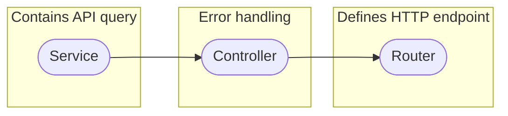

# 🌎 GeeLogic Application __*Node API*__ Documentation

Welcome to the documentation for the GeeLogic's Node based REST API. This API is designed to manage general data for the GeeLogic project, specifically focusing on algorithms submitted by users. The API provides endpoints to handle various functionalities related to algorithm data, including creation, modification, search, and retrieval.

## 📜 Table of Contents

- [👋 Introduction](#-introduction)
- [🏗️ File Structure](#-file-structure)
- [🏗️ API Structure](#-api-structure)
    - [👨‍💼 Admin Section](#-admin-section)
    - [👨‍🦱 Common Section](#-common-section)
        - [➕ Add](#-add)
        - [🔄 Modify](#-modify)
        - [👓 Search](#-search)
        - [🔎 Show](#-show)
- [📔 API Endpoints](#-api-endpoints)
- [🎆 How to write this API](#-how-to-write-this-api)

## 👋 Introduction

The GeeLogic Application NODE API is a Node.js-based RESTful API that manages algorithm data submitted by users. This documentation outlines the file structure of the API, along with explanations of the different components responsible for handling various functionalities.

## 🏗 File Structure

The API's file structure is organized into two main sections: **Admin** and **Common**.

- **Admin**: This section is dedicated to administrative functionalities not meant for regular application usage. Currently includes the ability to add a new tag, for better algorithm identification.
- **Common**: This section contains functionalities commonly used by the application, such as adding, modifying, searching, and showing algorithm data. Each functionality has its own set of service, controller, and router files which handle the operations of API queries.

```
📦node_API
 ┣ 📂api
 ┃ ┣ 📂admin
 ┃ ┃ ┣ 📜I.service.js
 ┃ ┃ ┣ 📜II.controller.js
 ┃ ┃ ┗ 📜III.router.js
 ┃ ┗ 📂common
 ┃   ┣ 📂add
 ┃   ┃ ┣ 📜I.service.js
 ┃   ┃ ┣ 📜II.controller.js
 ┃   ┃ ┗ 📜III.router.js
 ┃   ┣ 📂modify
 ┃   ┃ ┣ 📜I.service.js
 ┃   ┃ ┣ 📜II.controller.js
 ┃   ┃ ┗ 📜III.router.js
 ┃   ┣ 📂search
 ┃   ┃ ┣ 📜I.service.js
 ┃   ┃ ┣ 📜II.controller.js
 ┃   ┃ ┗ 📜III.router.js
 ┃   ┗ 📂show
 ┃     ┣ 📜I.service.js
 ┃     ┣ 📜II.controller.js
 ┃     ┗ 📜III.router.js
 ┣ 📂config
 ┃ ┗ 📜database.js
 ┣ 📂logger
 ┃ ┗ 📜logger.js
 ┣ 📂startup
 ┃ ┗ 📜routes.js
 ┣ 📜index.js
 ┗ 📜logfile.log
```

## 🏗 API Structure

This section will describe how the API is divided into two key sections: private - 'Admin' and public - 'Common'. Such a distribution was desirable to reserve some special abilities behind the developers and administrators of the application.

### 👨‍💼 Admin Section

The admin section handles administrative tasks related to the API. Currently this includes the ability to add additional tags to the database.

### 👨‍🦱 Common Section

The common section encompasses functionalities frequently used by the application. This includes addition of data, modification of data, searching the database and showing data upon user request.

Each folder contains three files; **service**, **controller** and **router**. They are responsible for storing the SQL query sent to the database, handling errors and attaching each API query to an endpoint, respectively.



#### ➕ Add

This sub-section is roughly responsible for queries that start with `INSERT` keyword, and use `POST` http command. These include inserting information about algorithms (such as title, code, description, user creator and api type), inserting information regarding which tags are associated with the algorithm and finally inserting data about which user bookmarked which algorithm.

#### 🔄 Modify

This sub-section is responsible for queries that modify existing data, such as any updates to the main body of algorithm data or adding an URL to an image from Firebase. Furthermore this assortment of API queries includes mechanisms to increment or decrement the votes for each algorithm and delete it entirely.

These queries correspond to having such keywords as `DELETE` and `UPDATE`, using http commands `DELETE` and `PATCH`.

#### 👓 Show

These sub-section hosts queries that are responsible for returning information on algorithms conditionally, such as by id or user creator.

These queries tend to use keyword `SELECT` and http command `POST`. Although `GET` would also be appropriate, Dart's http module is unable to send a package in the body of the request with `GET` command, leaving `POST` as a viable option.

#### 🔎 Search

This sub-section is similar to the one above as its primary primary purpose is also to return data. However it is different as its interactions are not logged since it is meant to be used at a much higher pace than any query at **Show**. 

These queries are used by the frontend to be called whenever any change is done to a search field by the user, allowing for dynamic return of information. This allows for a better user experience and easier search of desired data, however it also results in high use of these requests.

These queries are also associated with keyword `SELECT` and http command `POST`.


## 📔 API Endpoints

The API offers various endpoints to perform actions related to algorithm data management. However despite segregation inside the files of the API, every query of this API, in the `Common` section shares the same root. Similarly `Admin` queries have their own root.

Each query and endpoint can be explored further in this [Postman Collection](https://documenter.getpostman.com/view/25451165/2s9Y5R372Q).


## 🎆 How to write this API?

I have actually written a three part guide on Medium which describes my approach to writing a basic Node.JS API! You can find it [here](https://medium.com/@f.sulitskiy/rest-api-with-node-js-and-sql-from-scratch-part-i-outline-368420ae7899).
